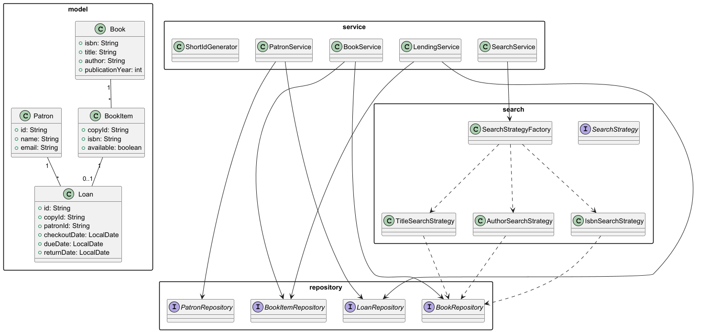

# Library Management System (Basic, Java-only, Short Loan IDs)

A minimal Library Management System in pure **Java 17** implementing only the **required features** with **short, human-friendly loan IDs** (e.g., `L-001`, `L-002`).

## ✅ Features
- **Book Management**: add, update, remove; `Book` has title, author, ISBN, publication year
- **Search**: by **title**, **author**, or **ISBN** via **Strategy + Factory**
- **Patron Management**: add/update patrons; **borrowing history**
- **Lending**: **checkout** and **return** with short Loan IDs
- **Inventory**: track available vs borrowed copies via `BookItem`
- **Logging**: JDK `java.util.logging`

## Design
- **OOP & SOLID**: services depend on interfaces; single-responsibility services; encapsulated models
- **Patterns**: **Strategy** (search), **Factory** (search factory)

## Class Diagram (PlantUML)
